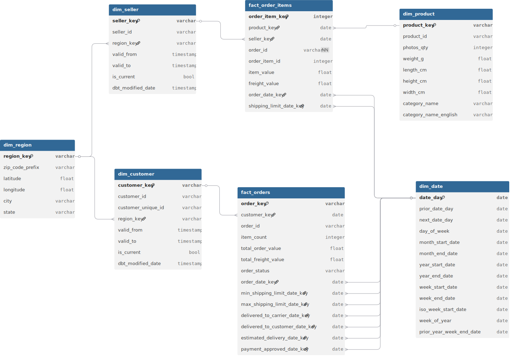

# Retail Analytics with DBT

The goal of this project is to design and implement an analytics data warehouse for an e-commerce store. The data model will be iteratively enhanced using a variety of tools, frameworks, and architectural patterns.

Given the fast-evolving nature of Analytics and Data Engineering, the ability to approach the same problem from multiple angles is a highly valuable skill. This project is structured around solving a consistent set of business questions using different technologies and methodologies — allowing for a comparative, hands-on exploration of modern data engineering practices.

While the primary motivation is personal development, all work will be documented to ensure the project is accessible and educational for others interested in learning or upskilling in this domain.

This same dataset is used in the following projects:
- [Retail Analytics with Spark](https://github.com/hardeybisey/retail-analytics-with-spark)
- [Retail Analytics with Dataflow](https://github.com/hardeybisey/retail-analytics-with-dataflow)
- [Retail Analytics with Airflow](https://github.com/hardeybisey/retail-analytics-with-airflow)
- [Retail Analytics with SQLMesh](https://github.com/hardeybisey/retail-analytics-with-sqlmesh)


## Project Technology Stack
* [Docker](https://docs.docker.com/engine/install/)
* [DBT](https://docs.getdbt.com/)
* [Postgres](https://www.postgresql.org/docs/)

---

**Link to full information and source of the dataset is [here](https://www.kaggle.com/datasets/olistbr/brazilian-ecommerce/data)**

---
## Data Context
he dataset is a synthetic e-commerce dataset simulating order activity between 2022 and 2024.

It captures the relationships between customers, sellers, orders, order items, and products, including category translations.
The data is structured to support analytics on customer behaviour, product sales, fulfilment timelines, and seller performance.
### **Raw Data Schema**


---

### **Data Dictionary**


| Dataset Name              | Description                                                                                                                                                                                | Key Columns                                    |
|--------------------------|--------------------------------------------------------------------------------------------------------------------------------------------------------------------------------------------|---------------------------------------------------------------|
| **Customers**            | Contains customer information and location.                                            | `customer_id`, `customer_address`, `customer_zip_code`, `customer_state`, `customer_created_date`, `customer_updated_date` |
| **Sellers**              | Data about sellers, including their location and identification. Used to trace product fulfilment.                                                                                         | `seller_id`, `seller_zip_code`, `seller_state`, `seller_created_date`, `seller_updated_date` |
| **Orders**               | Core dataset linking to all others. Represents individual purchases and delivery timelines.                                                                                                | `order_id`, `customer_id`, `order_status`, `order_purchase_timestamp`, `order_approved_at`, `order_delivered_carrier_date`, `order_delivered_customer_date`, `order_estimated_delivery_date` |
| **Order Items**          | Data on each item within an order. Includes quantity, value, and freight for each item.                                                                                                    | `order_id`, `order_item_id`, `product_id`, `seller_id`, `shipping_limit_date`, `price`, `freight_value` |
| **Products**             | Information about products sold. Includes name, category, and physical attributes.                                                                                                         | `product_id`, `product_category`, `product_name`, `product_size_label`, `product_width_cm`, `product_length_cm`, `product_height_cm`, `product_price`|
---

## Analytics Data Layers
* `staging`: Raw Data with light transformation
* `intermediate`: Shared Data Between Model
* `mart`:Analytics Ready Data
* `reports`: Views with prepagrregated joins on mart layer.

---

## Analytics Data Model

---

### Dimension
| Table Name              | Type      | Grain                             | Description                                                              |
|------------------------|-----------|-----------------------------------|--------------------------------------------------------------------------|
| dim_customer           | Dimension | 1 row per customer_key      | Unique customer profile, independent of orders                           |
| dim_region        | Dimension | 1 row per zip code prefix         | Geographic mapping of zip codes to state                  |
| dim_seller             | Dimension | 1 row per seller_key               | Seller metadata and location                                             |
| dim_product            | Dimension | 1 row per product_key              | Product metadata and physical attributes                                 |
| dim_product_category   | Dimension | 1 row per category name           | English translation of product categories                                |
| dim_date               | Dimension | 1 row per day                     | Date dimension for temporal analysis                                     |

---

### Facts

| Table Name              | Type      | Grain                             | Description                                                              |
|------------------------|-----------|-----------------------------------|--------------------------------------------------------------------------|
| fact_orders            | Fact | 1 row per order_key                 | Order lifecycle: purchase, delivery, status                              |
| fact_order_items       | Fact | 1 row per order_item_key(`order_id+item_id`)       | Item-level value, freight, product, seller                               |                          |

---
## Project Setup Instructions

### Set up your environment
```bash
# 1. Rename the environment file
mv example.env .env

# 2. Edit the .env file to include your Postgres credentials:
DB_USER=<your_postgres_username>
DB_PASSWORD=<your_postgres_password>

# 3. Start Services with Docker
docker compose up -d

# 4. Check that the container is up, you should look for a container named `dbt-container`
docker ps

# 5. Open a shell session into the dbt container
docker exec -it dbt-container bash

# 6. Unzip the `data.zip` file in the root of the repo and copy it's content into the dbt project seeds `retail-analytics-with-dbt/retail_analytics/seeds` folder
```

### Running the dbt model
Inside the dbt container, run the following commands in order:
```bash
# 1. Install dbt dependencies (e.g., packages from packages.yml)
dbt deps

# 2. Load CSV files from into Postgres as seed data
dbt seed

# 3. Apply snapshot logic (for SCD Type 2 tables like `customers` and `sellers`)
dbt snapshot

# 4. Run the core dbt models (transforms staging → marts)
dbt run

# 5. Execute tests (e.g., unique, not_null, relationships)
dbt test

# 6. Generate static documentation files
dbt docs generate

# 7. Serve the docs via a local web server (visit http://localhost:8080)
dbt docs serve
```
---

### DBT Lineage Diagram

---

## Credits
This project was inspired by this [repo](https://github.com/cnstlungu/postcard-company-datamart)
